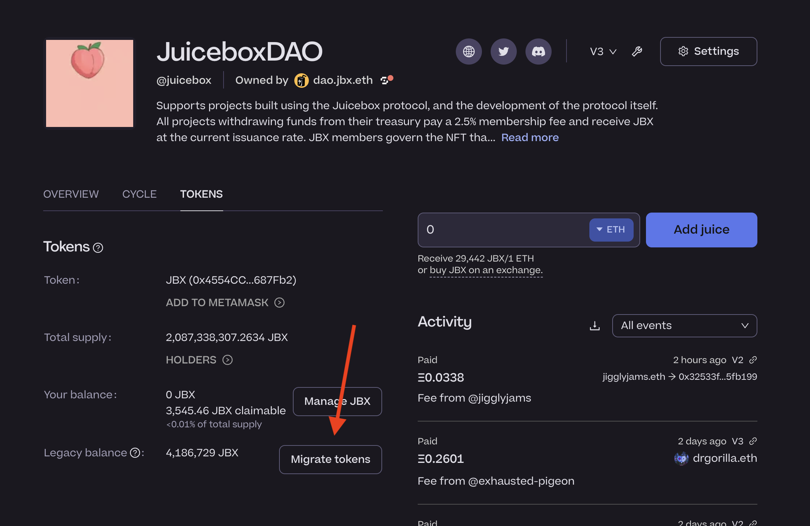
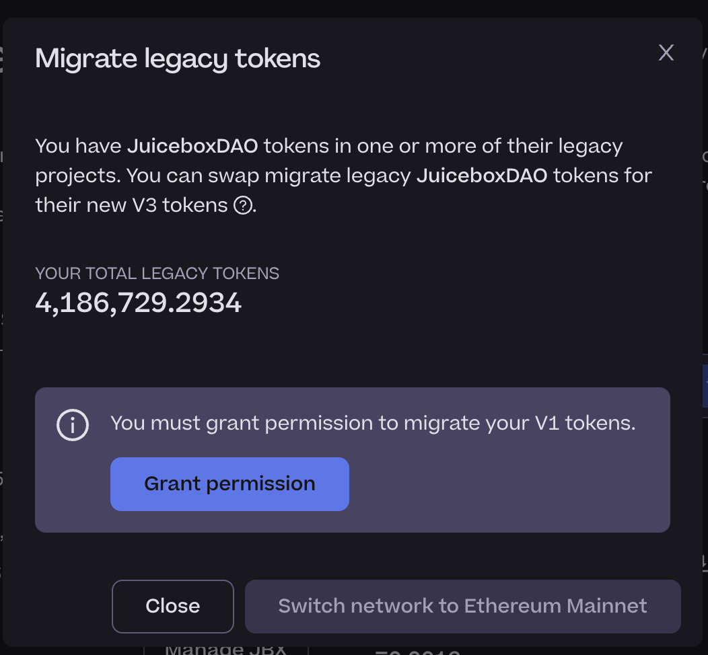
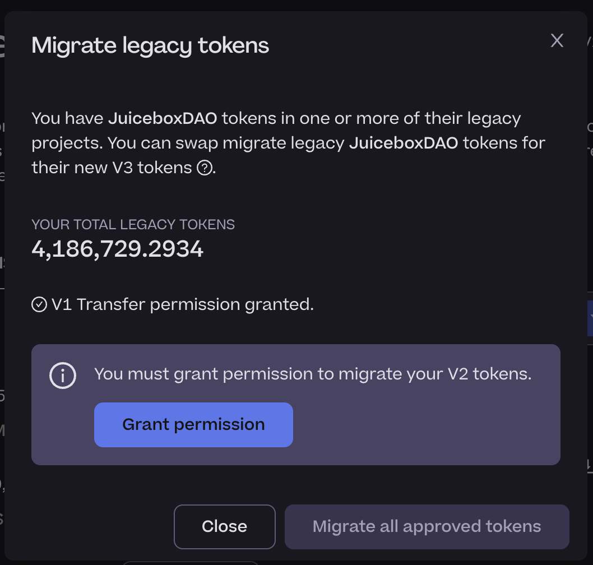
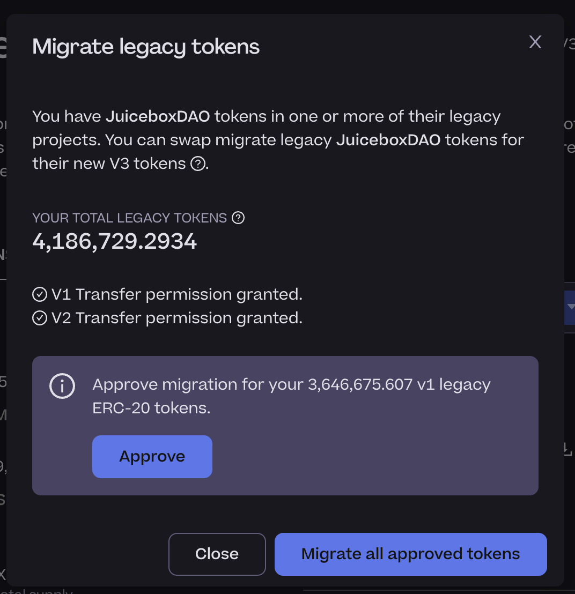
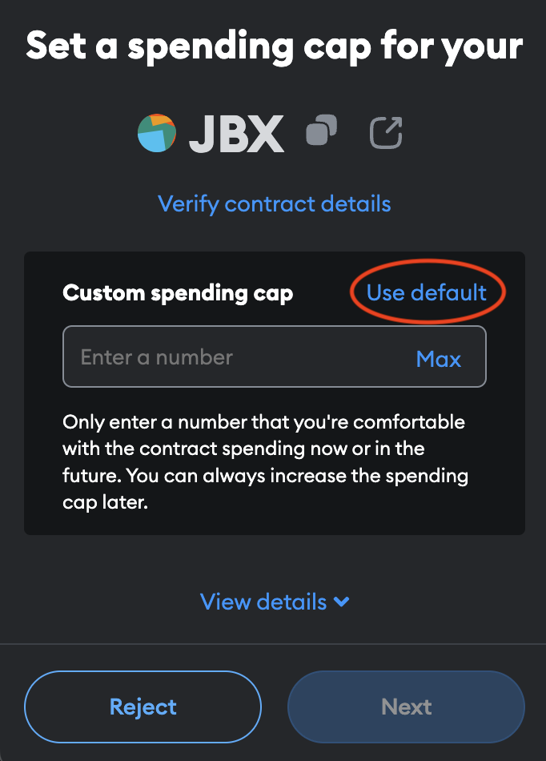
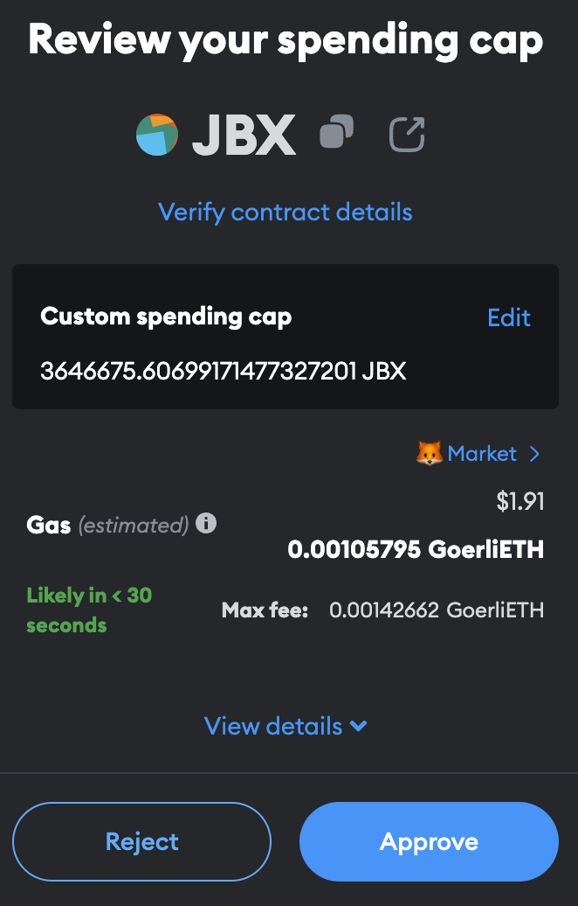
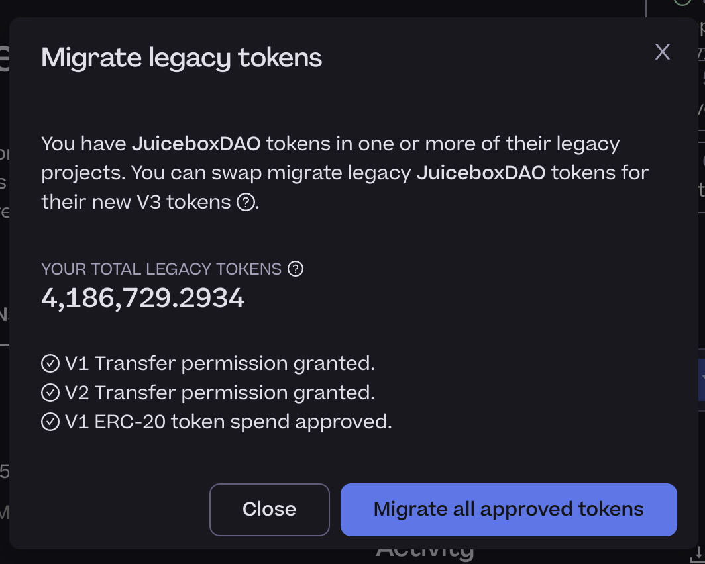

# JBX V3 migration guide

Got JBX? This guide is for you!

JuiceboxDAO has

## Before you start

Before you start, be aware of the following:

- This process will ask you to submit 3 or 4 transactions.
- This process can take 15 minutes or longer.
- You can migrate your tokens over time.

The following steps assumes the following:

- you have V1 JBX and Juicebox V2 tokens.
- you use Metamask

Your steps may be different depending on your situation.

## Migrate your JBX

Take the following steps to migrate your JBX to JBX V3:

1. Connect your wallet.
1. Navigate to the JuiceboxDAO project: https://juicebox.money/@juicebox.
1. Select the **Tokens** tab.
1. Observe the **Legacy tokens** section. If you have JBX from JuiceboxDAO's V1 or V2 project, you should have legacy tokens.
1. Select **Migrate tokens**.

    

1. Select **Grant Permission** for your V1 JBX.

   > This transaction grants the V3 JBX contract permission to transfer your JBX on your behalf. If you have JBX, this step is required for migration.

    

1. Select **Grant Permission** for your Juicebox V2 tokens.

   > This transaction grants the V3 JBX contract permission to transfer your Juicebox V2 tokens on your behalf. If you have Juicebox V2 tokens, this step is required for migration.

    

1. Select **Approve**.

   > This transaction approves the V3 JBX contract to spend your V1 JBX on your behalf. If you have JBX, this step is required for migration.

    

1. In Metamask, select **Default**. This will approve the spend of your total claimed V1 JBX balance.

    

1. Select **Next**.
1. Select **Approve**.

   

1. On the Juicebox website, select **Migrate all approved tokens**.

   > This transaction migrates all approved JBX and Juicebox V2 tokens to JBX V3.

   

1. Refresh the page and revist the **Tokens** tab. Verify the following:

- **Your balance**: should be greater than zero.
- **Legacy balance**: should be zero.

That's it!
