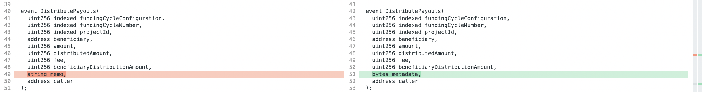
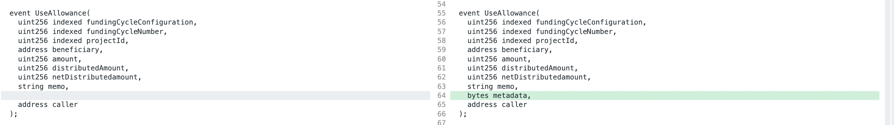
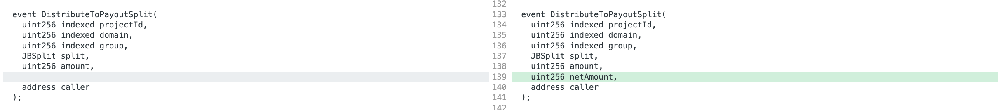
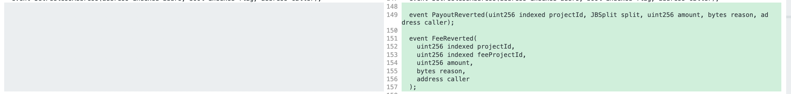

# 3.1 Specs

See [this proposal](https://juicetool.xyz/snapshot/jbdao.eth/proposal/0xb7b3ccd64f9b27ed001e7d086b11ae1dc78c56bd525840636a1a79d62ba14ccc) for context.

*Versions are on NPM under [@jbx-protocol/juice-contracts-v3 (3.1.0)](https://www.npmjs.com/package/@jbx-protocol/juice-contracts-v3) and [@jbx-protocol/juice-721-delegate (5.0.1)](https://www.npmjs.com/package/@jbx-protocol/juice-721-delegate)*

### Spec changes from `JBController` ⇒ `JBController3.1`

*See full code diff here [https://www.diffchecker.com/bEuD9b4b/](https://www.diffchecker.com/bEuD9b4b/)*

1. Adherence to [`IJBController3_1`](https://github.com/jbx-protocol/juice-contracts-v3/blob/main/contracts/interfaces/IJBController3_1.sol), and no longer an adherence to [`IJBController`](https://github.com/jbx-protocol/juice-contracts-v3/blob/main/contracts/interfaces/IJBController.sol).
2. Addition of a [`fundAccessConstraintsStore`](https://github.com/jbx-protocol/juice-contracts-v3/blob/f22a70fc2210ef252f76ccace711830ddb21356f/contracts/JBController3_1.sol#L128) property of type [`IJBFundAccessConstraintStore`](https://github.com/jbx-protocol/juice-contracts-v3/blob/main/contracts/interfaces/IJBFundAccessConstraintsStore.sol), which points to a contract that exposes two view functions that were previously exposed directly from the controller:
	- `function distributionLimitOf(uint256 _projectId, uint256 _configuration, IJBPaymentTerminal _terminal, address _token) external view returns (uint256, uint256)`
	- `function overflowAllowanceOf(uint256 _projectId, uint256 _configuration, IJBPaymentTerminal _terminal, address _token) external view returns (uint256, uint256)`
3. No more availability of the following function signatures:
    - `function reservedTokenBalanceOf(uint256 _projectId, uint256 reservedRate) external view returns (uint256)`
	    - new one removes `_reservedRate` argument
    - `function totalOutstandingTokensOf(uint256 _projectId, uint256 _reservedRate) external view returns (uint256)`
        - new one removes `_reservedRate` argument
    - `function distributionLimitOf(uint256 _projectId, uint256 _configuration, IJBPaymentTerminal _terminal, address _token) external view returns (uint256, uint256)`
	    - moved to `fundAccessConstraintStore` property as described above (#2)
    - `function overflowAllowanceOf(uint256 _projectId, uint256 _configuration, IJBPaymentTerminal _terminal, address _token) external view returns (uint256, uint256)`
	    - moved to `fundAccessConstraintStore`property as described above (#2).
4. New availability of the following function signatures:
	- `function reservedTokenBalanceOf(uint256 _projectId) external view returns (uint256)`
	- `function totalOutstandingTokensOf(uint256 _projectId) public view returns (uint256)`
    

### Spec changes from `JBPayoutRedemptionPaymentTerminal` ⇒ `JBPayoutRedemptionPaymentTerminal3.1`

*See full code diff here [https://www.diffchecker.com/7Zf5CnrL/](https://www.diffchecker.com/7Zf5CnrL/)*

1. Adherence to [`IJBPayoutRedemptionPaymentTerminal3_1`](https://github.com/jbx-protocol/juice-contracts-v3/blob/main/contracts/interfaces/IJBPayoutRedemptionPaymentTerminal3_1.sol), and no longer an adherence to [`IJBPayoutRedemptionPaymentTerminal`](https://github.com/jbx-protocol/juice-contracts-v3/blob/main/contracts/interfaces/IJBPayoutRedemptionPaymentTerminal.sol).
2. The standard `addToBalanceOf` call no longer refunds held fees. A new overloaded function signature with an added explicit parameter has been added for adding to balance with refunding held fees. See the new event signatures below.
3. Payouts from one project to other projects or allocators that revert will be caught and funds will be returned to the paying project, instead of reverting the entire distribution altogether. This include fees paid down to the protocol project.
4. No more availability of the following function signatures:
    - `function distributePayoutsOf(uint256 _projectId, uint256 _amount, uint256 _currency, address _token, uint256 _minReturnedTokens, string calldata _memo) external virtual returns (uint256 netLeftoverDistributionAmount)` 
        - new one replaces `_memo` with `_metadata`
    - `function useAllowanceOf(uint256 _projectId, uint256 _amount, uint256 _currency, address _token, uint256 _minReturnedTokens, address payable _beneficiary, string memory memo) external virtual returns (uint256 netDistributedAmount)` 
        - new one adds `metadata`
5. New availability of the following function signatures:
    - `function distributePayoutsOf(uint256 _projectId, uint256 _amount, uint256 _currency, address _token, uint256 _minReturnedTokens, bytes calldata _metadata) external virtual returns (uint256 netLeftoverDistributionAmount)`
    - `function useAllowanceOf(uint256 _projectId, uint256 _amount, uint256 _currency, address _token, uint256 _minReturnedTokens, address payable _beneficiary, string memory _memo, bytes calldata _metadata) external virtual returns (uint256 netDistributedAmount)`
    - `function addToBalanceOf(uint256 _projectId, uint256 _amount, address _token, bool _shouldRefundHeldFees, string calldata _memo, bytes calldata _metadata) public payable virtual`
6. New event signatures:
    
    
    
    
    
    
    
    
    

### Spec changes from `JBTiered721Delegate` ⇒ `JBTiered721Delegate3.1`

1. The [`JB721TierParams`](https://github.com/jbx-protocol/juice-721-delegate/blob/main/contracts/structs/JB721TierParams.sol) structs sent when adding new tiers have new/revised properties to allow for royalties and categorization.
2. Send category of 1 until further notice for default behavior.
3. The [`JB721Tier`](https://github.com/jbx-protocol/juice-721-delegate/blob/main/contracts/structs/JB721Tier.sol) structs returned when paging tiers have new/revised properties with info about royalties and categorization.
4. Tiers can be paged by category. Send 0 to retrieve tiers from all categories. [See here](https://github.com/jbx-protocol/juice-721-delegate/blob/c8f2c39f3e251ce2bdde32d73b980516fec33f19/contracts/JBTiered721DelegateStore.sol#L265).
5. Owner can set a tier's encoded IPFS URI after the tier has been made. [See here](https://github.com/jbx-protocol/juice-721-delegate/blob/c8f2c39f3e251ce2bdde32d73b980516fec33f19/contracts/JBTiered721Delegate.sol#L493).
6. Tiers are now returned in chronological order of being added. New tiers added to a category are returned before previously added tiers, kind of like an activity feed of mintable posts.
