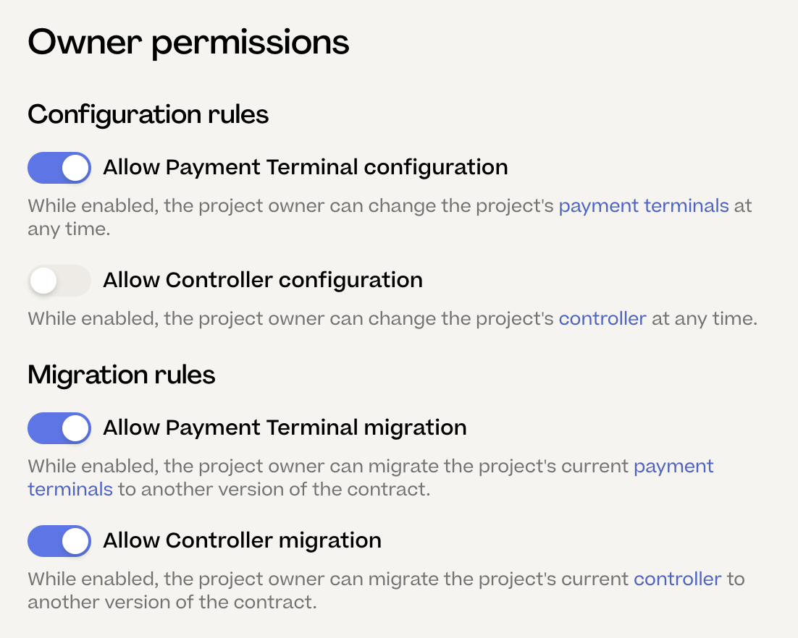
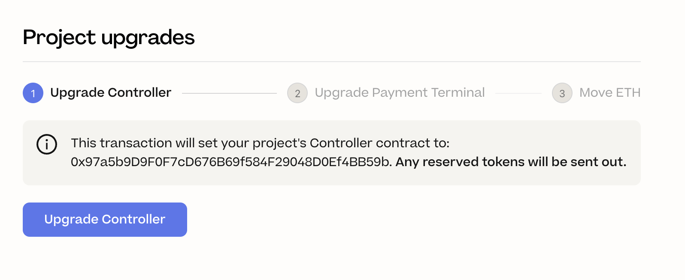
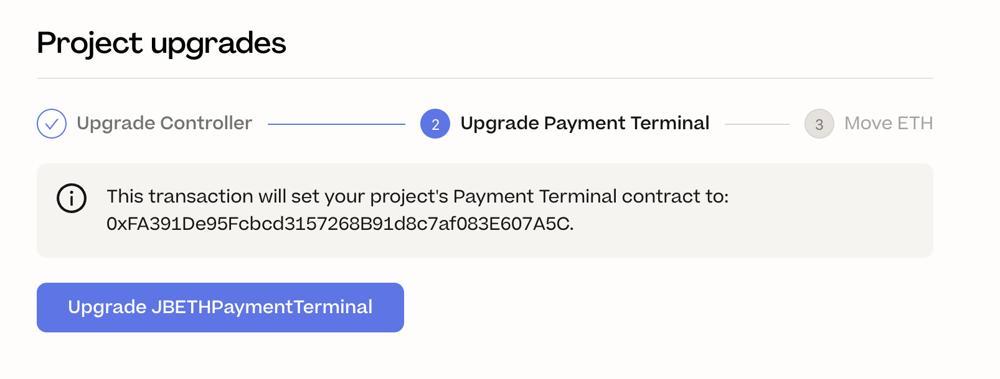
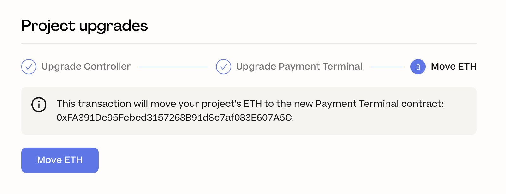
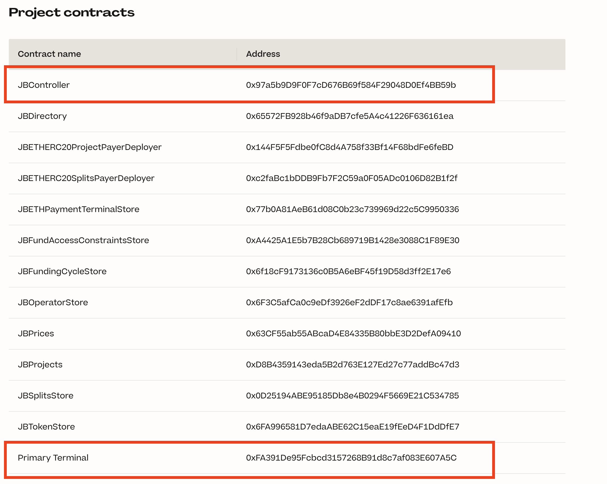

# Upgrade your Juicebox project to v3.1

This guide describes how project creators can upgrade their Juicebox project from version 3.0 to version 3.1.

## Should I upgrade?

Upgrading to Juicebox v3.1 is optional. If you're unsure if you need to upgrade, you probably don't!
To decide if you should upgrade, reach out to a JuiceboxDAO contributor in Discord to discuss your project.

## How to upgrade

Take the following steps to upgrade your project to Juicebox v3.1.

**Before you start**:

- You must be the project owner.
- There are (at most) 4 on-chain transactions that you'll need to execute. Have your wallet ready.
- Allow 15 minutes.

### Update your cycle's rules

To upgrade to v3.1, your project's current cycle must have the following rules enabled:

- Allow Payment Terminal configuration
- Allow Payment Terminal migration
- Allow Controller migration

If your cycle is locked, you'll need to wait until your next cycle to upgrade.

### Upgrade to v3.1

Once your cycle rules are active, take the following steps to continue the upgrade:

1. Connect to https://juicebox.money as the project owner.
1. Navigate to your project (e.g. https://juicebox.money/v2/p/1).
1. Select **Settings** > **Project upgrades**.
1. Select **Upgrade to Juicebox 3.1**

   

1. Select **Upgrade Controller**.

   This transaction will do the following:

   - Sets your project's JBController contract to JBController v3.1.
   - Distributes any of your project's reserved tokens.

   

1. Sign and submit the transaction, and wait for it to be confirmed.

1. Select **Upgrade Payment Terminal**.

   This transaction will do the following:

   - Sets your project's JBETHPaymentTerminal contract to JBETHPaymentTerminal v3.1.

   

1. Sign and submit the transaction, and wait for it to be confirmed.

1. Select **Move ETH**.

   This transaction will do the following:

   - Move your treasury funds from your old Payment Terminal to the new Payment Terminal

   

1. Sign and submit the transaction, and wait for it to be confirmed.

### Verify your upgrade

To verify your upgrade, navigate to your project's **Contracts** page `juicebox.money/YOUR_PROJECT/contracts`. Check that your **JBController** and **Primary Terminal** addresses match the **JBController3_1** and **JBETHPaymentTerminal3_1** addresses from the [Contract Addresses list](/dev/resources/addresses/#ethereum-mainnet).

   
